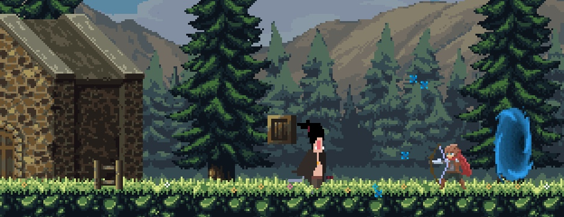

# Retake-Souls
The india game created in 48 hours and 2 cans of beer.

### Story
You are a wanderer who finds himself in an unknown world inhabited by skeletons, slugs and berserkers. So good that your sword is always with you!

### Control
```
Keyboard:
W - Jump
S - Roll
A / D - Move
SPACE - Attack (3-x Combo)
E - Dialogue with NPC
```

### Screenshot


### Download
I published game on itch.io. You can download and play by [link](https://vernikoff.itch.io/retake-souls)

### About me
Author this game Remsha Igor,
3rd year student

Created in Mar, 2020
